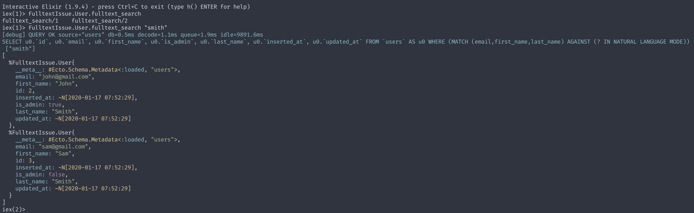

# FulltextIssue

## Installation

  * Install dependencies with `mix deps.get`
  * Create and migrate your database with `mix ecto.setup`
  * Install Node.js dependencies with `cd assets && npm install`
  * Start Phoenix endpoint with `mix phx.server`

## The issue

Using Ecto fragments with MySQL fulltext search does not work properly on tests using `Ecto.Adapters.SQL.Sandbox`, although it works correctly in any other env.

The second migration file adds a [fulltext](https://dev.mysql.com/doc/refman/5.7/en/fulltext-natural-language.html) index to the `users` table against its `email`, `first_name` and `last_name` columns. 

```elixir
defmodule FulltextIssue.Repo.Migrations.AddFulltextIndexToUsers do
  use Ecto.Migration

  def change do
    execute("ALTER TABLE users add FULLTEXT (email,first_name,last_name);")
  end
end
```

The `User` module has a function which runs the fulltext search:

```elixir
  def fulltext_search(query \\ User, text) do
    query =
      from(d in query,
        where:
          fragment(
            "MATCH (email,first_name,last_name) AGAINST (? IN NATURAL LANGUAGE MODE)",
            ^text
          )
      )

    Repo.all(query)
  end
```

If we run the interactive shell and call the function, everything goes as expected:



However, running the test for the user module fails:


